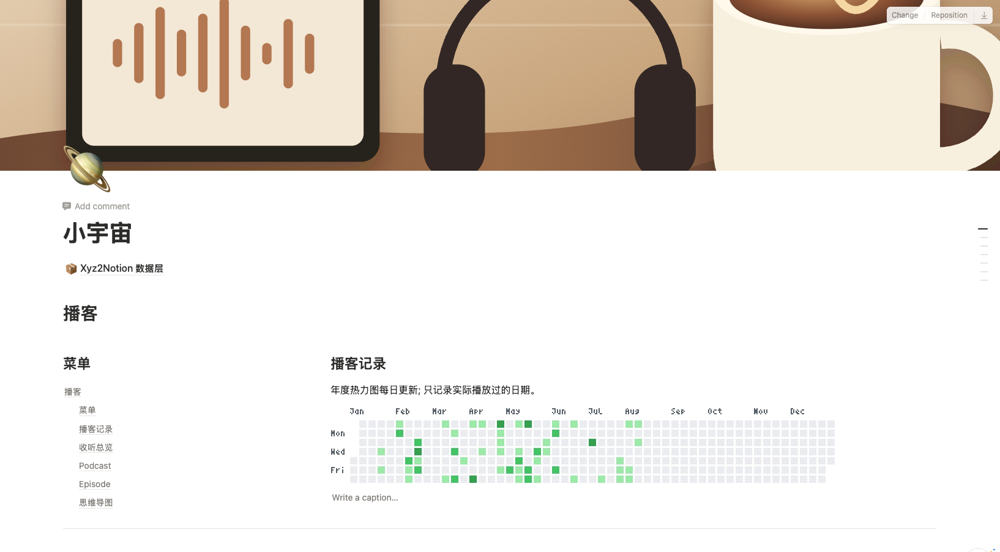
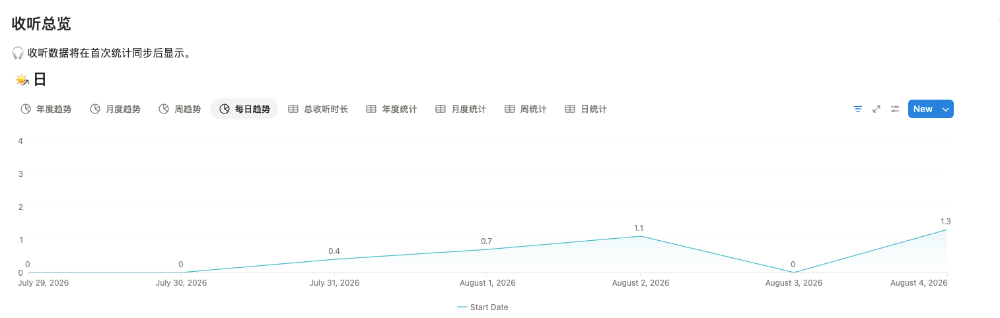
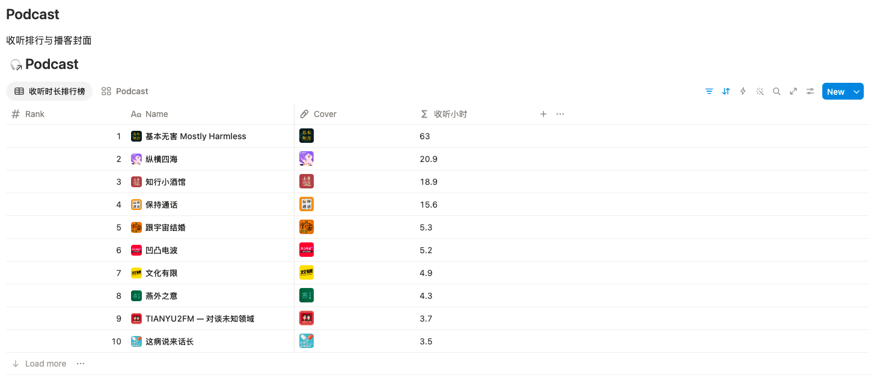
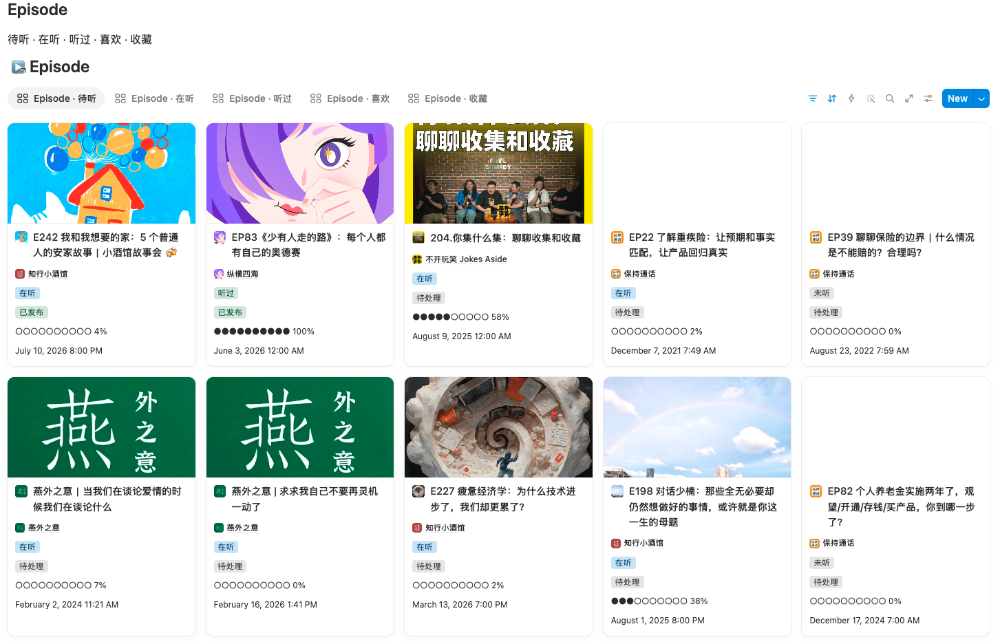
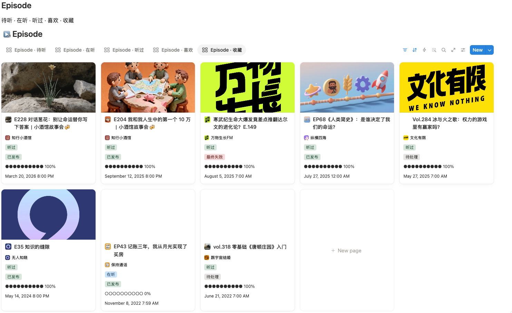
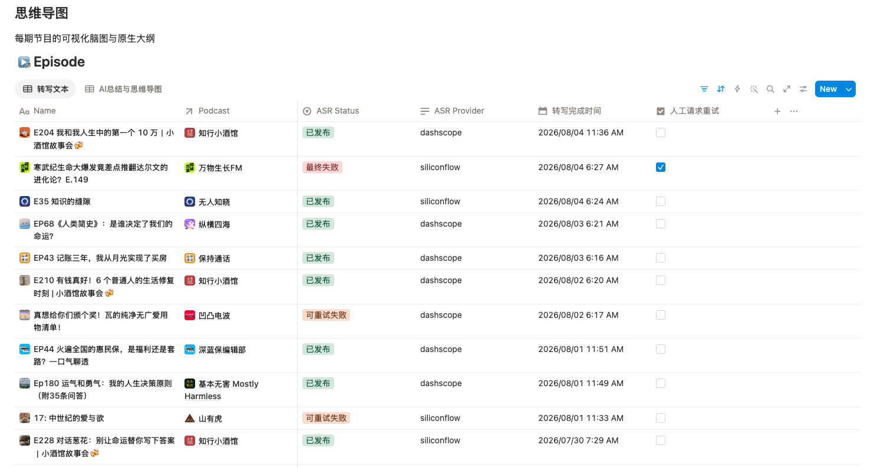
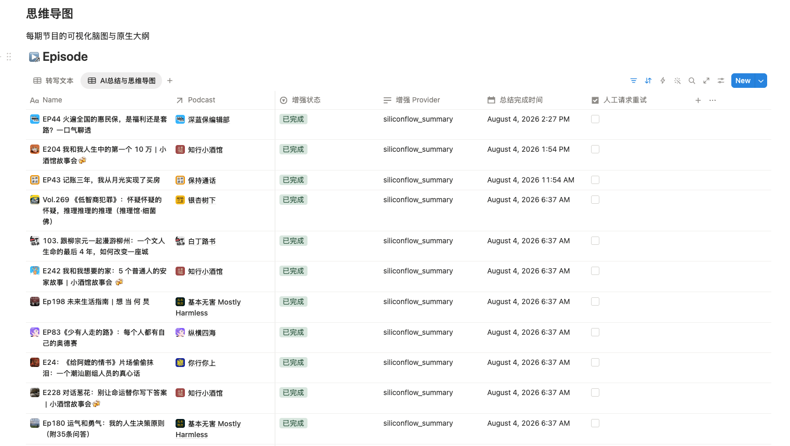

# Xyz2Notion

Xyz2Notion 是一个完全自托管的播客工作流：用 GitHub Actions 从小宇宙同步播放记录、待听播放列表、收藏、喜欢和播放进度，写入自己的 Notion，并为符合条件的单集生成文字稿、摘要、章节和思维导图。

项目不依赖作者服务器、NotionHub 插件或激活服务。所有任务运行在你自己的 GitHub Actions 中，凭证只通过 GitHub Secrets/Variables 注入。

当前版本：**v0.2.0**

## Features

- **小宇宙同步**：订阅、作者、播放历史、播放进度、待听、喜欢和收藏。
- **Notion 一体化**：Podcast、Episode、Author、统计、文字稿和思维导图数据库，以及主页视图、排行、趋势图和热力图。
- **AI 转写与增强**：百炼、SiliconFlow 和本地 Whisper/Qwen 的安全降级链路。
- **事件驱动队列**：同步后自动接续转写，转写完成后接续摘要、章节和思维导图；支持检查点恢复和 Notion 人工优先请求。
- **Notion 视图自检**：可只读审计视图配置；初始化只清理残留或重复属性 ID，保留合法自定义字段，并在触碰 API 上限前明确停止。
- **自主可控**：只使用用户自己的 GitHub、Notion、百炼和 SiliconFlow，内置小宇宙限速、数量上限和风控熔断。

## 预览

下面是当前 Notion 页面和主要视图的实际效果：

### Notion 主页

### 收听统计

### Podcast 排行

### Episode 状态视图

### 转写与 AI 增强

## 三步开始

### 1. Fork 并配置凭证

Fork 本仓库，在 `Settings → Secrets and variables → Actions` 添加小宇宙、Notion 以及需要的 AI 凭证。具体名称和配置方式见 [GitHub Actions 与 Secrets](docs/github-actions.md)。

### 2. 初始化并同步

首次在 Actions 运行 `Initialize Notion` 的 `bootstrap`，再运行一次 `Sync Podcast Metadata`。初始化会创建数据层和主页视图；后续运行是幂等的，不会重复追加布局或清空用户内容。

如果只是检查视图，不要运行同步：在 Actions 运行 `Audit Notion View Configurations`，或在
`Initialize Notion` 中选择 `audit-view-configurations`。这是只读操作，不访问小宇宙，也不修改 Notion。

### 3. 启用 AI 队列

先各手动运行一次 `Transcribe Episode Queue` 和 `Enrich Transcribed Episodes`，确认凭证与 Notion 页面可用，再打开日常队列变量。正常链路为：每天增量同步 → 转写 → 摘要/章节/思维导图；失败和人工请求由检查点队列自动恢复。

详细的 Secret、Variable、初始化顺序、运行频率和限额见 [GitHub Actions 与 Secrets](docs/github-actions.md)。

## 更多说明

按主题查看完整说明：

### 配置、认证与成本

- [GitHub Actions 与 Secrets](docs/github-actions.md)
- [完整配置](docs/configuration.md)
- [小宇宙认证与安全边界](docs/xiaoyuzhou-auth.md)
- [成本与免费策略](docs/costs.md)

### AI 转写、摘要与恢复

- [百炼 Paraformer ASR](docs/dashscope-asr.md)
- [SiliconFlow ASR](docs/siliconflow-asr.md)
- [本地 Whisper 兜底](docs/local-whisper.md)
- [摘要、章节与思维导图](docs/ai-enrichment.md)
- [Episode 单集页面与人工笔记](docs/episode-page.md)
- [故障排查与重试](docs/troubleshooting.md)

### Notion 数据、界面与统计

- [Notion 模板、数据库与视图](docs/notion-template.md)
- [旧 Podcast2Notion 模板迁移](docs/migration.md)
- [统计口径与热力图](docs/statistics.md)

### 开发与验收

- [QA 与故障注入矩阵](docs/qa-matrix.md)

## 最近更新

- **2026-08-08**：完成 Notion 视图配置修复：新增只读审计，清理残留/重复属性 ID，显式重置后再写回，并统一 URL 编码与解码后的属性 ID。一次性归档了 4 个重复的根页面 linked database 容器并重建 18 个托管视图；数据库、字段、页面和 AI 内容均保留。
- **2026-08-08**：最终审计确认 Episode 相关视图的配置项均为合法字段（`known=42`、`unknown=0`）；`configuration.properties=42` 不是 42 个可见列，实际可见列由 `visible=true` 计数，当前为 5/6/7。
- **2026-08-04**：AI 视图、增强状态/Provider、人工优先重试和事件接续链路完善。
- **2026-08-04**：百炼 ASR 增加三个 Paraformer 模型的内部降级。
- **2026-08-03**：统计日期统一按 UTC+8 计算。
- **2026-07-31**：移除听悟网页 Cookie 链路，改用百炼 → SiliconFlow → 本地模型。

完整日期记录见 [CHANGELOG.md](CHANGELOG.md)。

## 许可证

[MIT](LICENSE)
