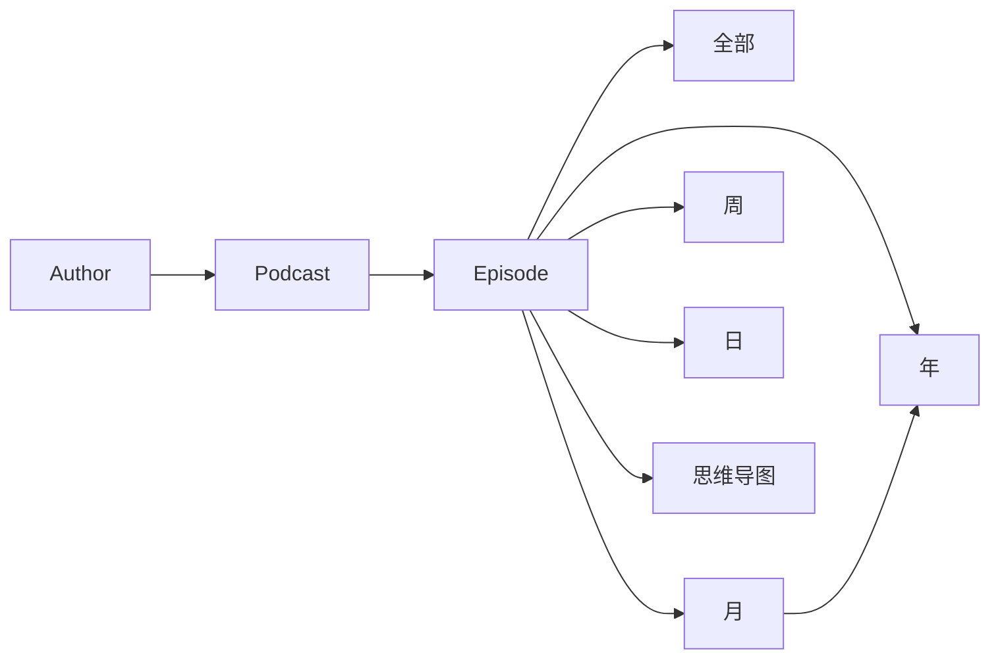

# Podcast2Notion：Notion 界面完整还原规格

## 一、还原目标

第一版不能只同步数据，必须同时还原作者公开 Demo 中的 Dashboard 信息架构、统计口径、数据库关系和主要视图。

“完整还原”的验收定义：

- 页面模块、左右分栏、出现顺序与 Demo 一致；
- 数据库、Relation、Rollup、Formula 和统计口径一致；
- Gallery、List、Table 等视图的过滤、排序、分组、卡片预览和字段可见性一致；
- 热力图的年份、月份、星期和颜色梯度一致；
- 播客封面、单集图标、状态标签和收听进度环一致；
- 不依赖作者的服务器或模板，初始化脚本可在用户自己的 Notion 中自动创建；
- 因 Notion 客户端字体、窗口宽度、系统主题和官方 UI 更新造成的像素差异，不算功能偏差。

## 二、Demo 首页结构

```text
播客
├── 页面封面与圆形页面图标
├── 年度播客收听热力图
├── 左栏
│   ├── 圆形个人头像
│   ├── 菜单 / 页面目录
│   ├── 总收听时长
│   ├── 年统计
│   ├── 日统计
│   ├── 周统计
│   ├── 月统计
│   └── 收听时长排行
└── 右栏
    ├── Podcast Gallery
    ├── Episode Gallery
    │   ├── 全部
    │   ├── 在听
    │   ├── 听过
    │   └── 喜欢
    └── 思维导图 Table
```

## 三、首页模块逐项还原

| Demo 模块 | 原界面表现 | 自主实现 |
| --- | --- | --- |
| 页面封面 | 播客、耳机、咖啡主题横幅 | 仓库提供默认开源封面；允许用户替换 |
| 页面图标 | 圆形渐变星球图标 | 仓库自带图标或用户配置 URL |
| 个人头像 | 左栏圆形头像 | 初始化配置提供 `profile_image_url` |
| 菜单 | 总收听时长、排行、Author、Podcast、Episode、思维导图 | 原生目录或跳转链接块 |
| 年度热力图 | GitHub Contribution 风格，按月展示收听日期 | GitHub Action 本地生成 SVG/PNG，再上传到 Notion；不使用作者热力图服务 |
| 总收听时长 | “全部”卡片，显示累计小时和分钟 | `全部`统计数据库 + Episode Rollup |
| 年统计 | 年份、播客数、收听天数、收听时长 | `年`数据库 + Relation/Rollup |
| 日统计 | 每日收听记录 | `日`数据库 + Relation/Rollup |
| 周统计 | ISO 年周、收听播客数 | `周`数据库 + Relation/Rollup |
| 月统计 | 月份、收听单集数、时长、天数 | `月`数据库；历史月份优先使用小宇宙 monthly-wrapped 精确数据 |
| 收听排行 | 按播客累计收听时长排序的列表 | Podcast 数据库按 `收听时长` 降序 |
| Podcast | 五列左右的封面 Gallery | Podcast Gallery，卡片封面使用播客封面 |
| Episode | 多列 Gallery，状态和进度可视化 | Episode Gallery + Formula 进度环 |
| 思维导图 | 标题、状态、Episode 关系表 | 思维导图数据库或 Episode 内嵌大纲；为界面一致保留独立数据库视图 |

## 四、数据库和关系

为忠实复刻 Demo，保留以下数据库：

1. `Podcast`
2. `Episode`
3. `Author`
4. `全部`
5. `年`
6. `月`
7. `周`
8. `日`
9. `思维导图`

关系主线：



## 五、统计口径

### 总收听时长

- 所有播客的 `playedSeconds` 累加；
- 显示为“X 小时 Y 分钟”；
- 内部保留原始秒数，避免多次换算产生误差。

### Podcast 累计收听时长

- 首选小宇宙 `v1/mileage/list` 返回的播客级累计值；
- 用于 Podcast Gallery 和收听时长排行榜；
- 排行按原始秒数降序，而不是按格式化字符串排序。

### Episode 收听进度

- `progress / duration`；
- 未听：灰色；
- 在听：蓝色状态；
- 听过：绿色状态；
- 喜欢：独立收藏视图；
- 卡片显示百分比和环形进度 Formula。

### 年、月、周、日

- Episode 按最近播放日期关联到年、月、ISO 周和日；
- 周标题格式为 `YYYY年第WW周`；
- 月标题格式为 `YYYY年MM月`；
- 日标题格式为 `YYYY年MM月DD日`；
- 月统计对已结束月份调用小宇宙 `monthly-wrapped/get`，补充精确的 `收听时长` 和 `收听天数`；
- 当前月份从 Episode 记录滚动计算，月末后再用 monthly-wrapped 校正。

### 收听天数

- 同一天有一条或多条播放记录都只计 1 天；
- 历史月份优先采用小宇宙月记值；
- API 无数据时按 Episode `playedAt` 去重推导，并标记来源。

### 播客数量与单集数量

- 播客数为统计周期内出现过播放记录的去重 Podcast 数；
- 单集数为周期内有播放记录的去重 EID 数；
- 不能把同步进 Notion 但从未播放的节目计入收听统计。

## 六、视图配置

### Podcast

- 类型：Gallery；
- 排序：`收听时长` 降序；
- 卡片预览：页面封面；
- 显示：播客名、最后更新时间、格式化收听时长、RSS/链接；
- 隐藏内部字段：PID、原始秒数、同步时间等。

### Episode

公共配置：

- 类型：Gallery；
- 排序：最近播放时间降序；
- 卡片预览：页面图标或播客封面；
- 显示：标题、状态、播放日期、进度百分比、进度环。

四个视图：

| 视图 | 过滤条件 |
| --- | --- |
| 全部 | 有效 Episode |
| 在听 | `状态 = 在听` |
| 听过 | `状态 = 听过` |
| 喜欢 | `喜欢 = true` |

### 年、月、周、日

- 首页左栏使用 List 或紧凑 Gallery；
- 日期倒序；
- 仅显示标题和核心 Rollup；
- 年、月卡片显示播客数、单集数、收听天数、格式化收听时长；
- 日、周默认折叠为较少条目，避免首页无限增长。

### 思维导图

- 类型：Table；
- 显示：标题、状态、Episode；
- 状态值：`In progress`、`Done`、`Failed`；
- 点击标题进入脑图详情页。

## 七、热力图自主实现

作者原实现依赖 `heatmap.malinkang.com`。新项目改为：

1. 从 `日`数据库或 Episode 播放日期汇总每日收听秒数；
2. GitHub Action 本地生成 GitHub Contribution 风格 SVG；
3. 根据每日收听时长分 0–4 级绿色；
4. 标注 Jan–Dec；
5. 生成年度 PNG/SVG；
6. 上传为 Notion Image block；
7. 每次同步只更新当前年度图片。

这样保留 Demo 视觉，不依赖作者服务器。

## 八、自动初始化

采用 Notion API `2026-03-11`：

- 创建九个数据库及属性；
- 创建 Relation、Rollup 和 Formula；
- 创建左右 Column 布局；
- 创建 Linked Database Views；
- 写入每个视图的过滤、排序和配置；
- 设置页面封面、图标、菜单和热力图占位块。

新版 Views API 已支持 Table、Board、Calendar、Timeline、Gallery、List、Chart、Map 和 Dashboard，并能创建 Linked Database View，因此不要求用户手工搭模板。

初始化必须幂等：

- 已存在的数据库和视图按内部键识别；
- 缺失时创建；
- 配置版本改变时迁移；
- 不覆盖用户自己新增的视图或笔记。

## 九、还原边界

可以完全还原的是：

- 数据结构；
- 统计数字；
- 数据库关系；
- 模块顺序；
- 左右栏布局；
- 视图类型、过滤和排序；
- 卡片显示字段；
- 热力图；
- 单集进度和状态；
- 思维导图入口。

不能承诺逐像素永远一致的是：

- Notion 官方字体、留白和卡片尺寸；
- 不同屏幕宽度下 Gallery 列数；
- 深色/浅色模式颜色；
- Notion 后续 UI 改版；
- 用户替换封面、头像和图标后的视觉。

因此项目验收用“同一 Notion 客户端、同一窗口宽度下，信息架构和主要视觉模块一致”，而不是对 Notion 官方渲染做像素级控制。

## 十、验收

1. 新建空白 Notion 页面，一次初始化后无需手工建库或配置视图；
2. 首页模块顺序与 Demo 一致；
3. Podcast、Episode、年/月/周/日、全部、Author、思维导图均可打开；
4. Episode 的四个视图过滤正确；
5. 累计时长、排行榜、月统计和收听天数与原始接口数据核对一致；
6. 热力图日期和每日数据一致；
7. 连续运行初始化两次不产生重复数据库或重复视图；
8. 用户新增的页面块、笔记和视图不被删除；
9. 页面中不存在对 `malinkang.com`、`notionhub.app` 的运行时依赖。
