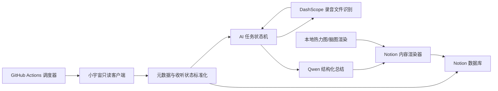

# 小宇宙到 Notion：开源重写调研与实施计划

## 一、结论

可以实现，而且应当采用“功能对齐、从头重写”的方式，不应继续依赖作者的 Pro 包或 NotionHub Runner。

目标边界：

- 运行环境仅使用用户自己的 GitHub Actions。
- 数据保存在用户自己的 Notion。
- 语音识别优先使用用户自己的通义听悟网页额度，失败后使用用户自己的 SiliconFlow API Key；千问总结和可选付费保险使用用户自己的 DashScope API Key。
- 不部署 VPS。
- 不依赖 NotionHub 插件、作者 OAuth、作者激活服务或作者的播放器、脑图、热力图服务器。
- 项目代码以 MIT 或 Apache-2.0 许可证完整开源。
- 代码本身免费；默认 ASR 路线当前可做到零调用费用，用户主动启用正式付费 API 时由使用者承担费用。

核心功能均可实现：

- 同步小宇宙订阅、主播、节目和已收听单集。
- 同步喜欢状态、已听/在听状态、播放进度、播放时间、单集时长。
- 同步每个播客的累计收听时长。
- 获取月度收听时长和收听天数。
- 生成收听日历和年度热力图。
- 通过多 Provider ASR 生成文字稿；听悟网页结果包含精确时间戳和说话人，SiliconFlow 降级结果为纯文本和切片级粗略时间轴。
- 调用千问生成全文摘要、章节速览、关键观点、问题回顾和结构化思维导图。
- 将音频播放器、摘要、脑图和文字稿写入 Notion 单集页面。
- 保留用户自己在单集页面里写的笔记，不被自动同步覆盖。
- 按作者公开 Demo 还原 Notion 首页的封面、左右栏、年度热力图、总时长、年/月/周/日统计、收听排行、Podcast Gallery、Episode 多视图和思维导图列表。

Notion 界面不是可选装饰，而是第一版正式验收项。完整规格见《Notion 界面完整还原规格》。

唯一无法做出永久保证的是“小宇宙私人收听数据接口”。小宇宙没有公开开发者 API，订阅、收听历史和进度仍需通过其 App 使用的非公开接口读取。这个接口目前可用，但将来可能变更或封禁。RSS 只能作为节目元数据和音频地址的降级方案，无法替代私人收听记录。

## 二、三篇文章实际对应什么

用户提供的内容里，前两段“小宇宙自动同步到 Notion”正文完全相同，应是同一篇文章被重复粘贴。按公开产品演进，实际有三个阶段。

| 阶段 | 对应实现 | 能力 | 主要问题 |
| --- | --- | --- | --- |
| 基础同步版 | `malinkang/Podcast2Notion` | 订阅、播客、已听单集、状态、基本时长同步 | 没有转写、AI 总结、脑图和独立播放器 |
| Pro 版 | `malinkang/Podcast2NotionPro` + PyPI `podcast2notion` | 增加进度、时间统计、热力图、通义听悟转写、摘要、脑图、播放器 | 使用通义网页 Cookie 和内部接口；依赖作者服务；已归档 |
| NotionHub 版 | NotionHub 插件 + `notionhub-runner` | 插件完成授权、配置、付费校验，并在 GitHub Runner 执行 | Runner 需向 `i.notionhub.app` 请求授权和下载私有运行包，仍受作者服务控制 |

作者在 2026 年更新后的基础仓库 README 已明确说明：免费 Runner 只同步 Podcast 和 Episode 基础数据，不包含 AI 转写、思维导图或播放器。

## 三、源码审计后的关键发现

### 1. 基础版

基础版直接调用以下小宇宙接口：

- `app_auth_tokens.refresh`：使用 Refresh Token 换取 Access Token。
- `v1/subscription/list`：订阅列表。
- `v1/mileage/list`：按播客统计累计收听时长。
- `v1/episode-played/list-history`：已收听单集历史。
- `v1/episode/list`：单个播客的单集列表。

它把播客和单集写入 Notion，并用 `Pid`、`Eid` 去重。当前实现仍基于旧版 Notion database API，且没有完整的状态机、成本控制和安全日志策略。

### 2. Pro 版

Pro 版新增：

- `v1/playback-progress/list`：单集播放进度和 `playedAt`。
- `v1/monthly-wrapped/get`：月度收听天数和收听秒数。
- 通义听悟网页内部接口：提交音频、查询任务、获取摘要、议程、问答、脑图和逐字稿。
- 第三方播放器、脑图和热力图服务。

它并非使用正式 DashScope API，而是保存整个通义网页 Cookie，然后模拟浏览器调用：

- `qianwen.biz.aliyun.com`
- `tw-efficiency.biz.aliyun.com`

这种方案存在 Cookie 过期、接口随时改变、账号风控和内部接口合规性风险，不能作为新的开源项目基础。

### 3. GitHub 仓库不是 Pro 工作流的唯一真实代码

Pro 工作流执行 `pip install -r requirements.txt`，其中包含未锁版本的 `podcast2notion`，随后运行 PyPI 安装生成的 `podcast` 和 `speech_text` 命令。因此，真实执行内容取决于 PyPI 包，而不只是仓库中可见代码。

核查 PyPI `podcast2notion==0.2.5` wheel（SHA-256：`4584669b74c7fa491c52990dedf613552ca8b0e7f30aa65e5d70b99286ce8bf6`）发现，其 `podcast` 命令运行时会向：

`https://podcast.notionhub.app/generate-activation-code`

发送以下内容：

- Notion Token
- 小宇宙 Refresh Token
- 通义 Cookie
- Notion 模板页面 ID

这与“数据和凭证只留在用户自己的 GitHub、Notion 和阿里云”原则冲突，新项目必须彻底移除。

### 4. NotionHub Runner 不是独立运行方案

当前 `notionhub-runner` 的 Podcast workflow 会：

- 获取 GitHub OIDC Token。
- 请求 `https://i.notionhub.app/v1/github/runner/runtime-bundle`。
- 校验付费/试用资格。
- 从作者服务器下载运行包后执行。

因此即使计算发生在 GitHub Actions，控制面和运行代码仍依赖作者服务器，作者停止服务后无法继续运行。

### 5. 许可证边界

三个 GitHub 仓库均没有标准 `LICENSE` 文件，GitHub API 也无法识别许可证。PyPI 元数据只声明了 MIT classifier，但未携带明确许可证正文。

新的项目应：

- 只复刻公开展示的功能行为。
- 不逐行复制作者代码、模板文案或 UI。
- 自己设计模块、数据库结构、提示词和状态机。
- 在新仓库中明确加入 MIT 或 Apache-2.0 许可证。

## 四、建议的自主架构



GitHub Actions 只负责调度和短暂计算；Notion 同时承担内容库和任务状态存储，不需要额外数据库。听悟网页和正式 DashScope 路线直接提交公网音频 URL；SiliconFlow 路线则在 Runner 临时下载、转码和切片。任何路线都不把音频保存为 Actions Artifact，任务结束后随临时 Runner 销毁。

## 五、Notion 数据模型

为完整还原作者 Demo，采用九个数据库：Podcast、Episode、Author、全部、年、月、周、日和思维导图。虽然可以用四库精简实现相同数据，但无法原样复刻 Demo 左栏统计卡片和关系页面，因此不采用精简方案。

### Podcasts

- `名称`：Title
- `PID`：唯一 ID
- `封面`
- `链接`
- `简介`
- `主播`：Relation 到 Authors
- `累计收听秒数`
- `最后更新时间`
- `同步更新时间`

### Episodes

- `标题`：Title
- `EID`：唯一 ID
- `Podcast`：Relation
- `发布时间`
- `最近播放时间`
- `总时长秒数`
- `收听进度秒数`
- `收听比例`：Formula
- `状态`：未听、在听、听完
- `喜欢`
- `小宇宙链接`
- `音频 URL`
- `AI 策略`：自动、手动、跳过
- `ASR 状态`
- `ASR Task ID`
- `AI 状态`
- `失败原因`
- `重试次数`
- `摘要版本`
- `文字稿版本`
- `自动生成根块 ID`：用于安全更新自动内容

### Authors

- `名称`
- `头像`
- `小宇宙用户 ID`

### 全部、年、月、周、日

- `标题`
- `周期开始`
- `周期结束`
- `收听秒数`
- `收听天数`
- `单集数`
- `播客数`
- `Episodes`：Relation
- `年`：月数据库 Relation 到年
- `数据来源`：月记精确值或播放历史推导值

### 思维导图

- `标题`
- `状态`
- `Episode`：Relation
- `脑图版本`
- `失败原因`

思维导图的正文同时写入 Episode 页面；独立数据库用于忠实还原 Demo 的首页列表和任务状态。用户笔记放在自动生成区域之外，程序永不删除。

## 六、AI 处理链路

### 1. 选择需要转写的单集

默认策略建议：

- 只处理已经播放过且进度不少于 120 秒的单集。
- 每次最多新提交 2–3 个任务。
- 支持 `finished_only`、`played_only`、`manual` 三种模式。
- 支持单集级“跳过”和“强制重做”。
- 提交前按音频时长估算费用，并受单次最大预算和每日最大预算限制。

### 2. 多 Provider 语音识别

本节原先采用“正式 DashScope ASR 优先”。经进一步核查通义听悟网页额度和 SiliconFlow 免费 ASR 后，调整为：

1. 通义听悟网页 Cookie：优先消耗用户已有的网页转写时长，并取得说话人、时间戳、摘要和脑图。
2. SiliconFlow 官方免费 API：Cookie 失效、风控或内部接口改变时自动降级，默认使用 `FunAudioLLM/SenseVoiceSmall`，方言内容可改用 `TeleAI/TeleSpeechASR`。
3. 正式 DashScope API：默认关闭，仅作为用户主动启用且受预算上限约束的最终保险。

完整调查、限制和错误降级规则见《语音识别方案全面调查与 Fallback 设计》。

### 3. 可选的正式录音文件识别 API

首选 `fun-asr`：

- 支持最长 12 小时、2 GB 文件。
- 支持主流播客音频格式。
- 支持句子和词语时间戳。
- 支持说话人分离。
- 中文、方言和复杂音频的识别能力更强。

低成本选项为 `paraformer-v2`。按当前官方目录价：

- `fun-asr`：0.00022 元/秒，1 小时约 0.792 元。
- `paraformer-v2`：0.00008 元/秒，1 小时约 0.288 元。

说话人分离建议只对两小时以内的节目开启；更长节目默认关闭说话人分离，或在后续版本增加分段。

### 4. 异步状态机

每个 Episode 按以下状态推进：

`DISCOVERED → ASR_SUBMITTED → ASR_RUNNING → TRANSCRIBED → ENRICHED → PUBLISHED`

失败分为：

- `FAILED_RETRYABLE`：429、服务暂时不可用、Notion 529 等。
- `FAILED_FINAL`：无音频地址、Token 无效、音频不可下载、格式不支持。

任务 ID 和状态写回 Notion。下一次 GitHub Action 继续处理，不在单次工作流里长时间等待。这样即使 Actions 被中断也不会重复扣费。

### 5. 千问总结

把文字稿按章节或 Token 窗口分段，再使用 map-reduce 方式生成最终 JSON：

- 全文摘要
- 章节标题、开始时间和章节摘要
- 关键观点
- 金句
- 术语和人物
- 问题回顾
- 思维导图树

使用支持 JSON Mode 的千问模型，并通过 JSON Schema 校验；校验失败时只修复 JSON，不重新做 ASR。推荐默认使用 `qwen3.5-flash` 非思考模式，成本较低且上下文足够大。

### 6. 写入 Notion

Episode 页面自动生成区域包含：

1. Notion 原生 Audio block，直接播放 `.mp3`、`.m4a` 等公网音频，不再使用作者播放器。
2. 全文摘要。
3. 章节速览和时间戳。
4. 关键观点、金句和问题回顾。
5. 原生嵌套大纲形式的思维导图。
6. 本地生成并上传到 Notion 的脑图 PNG/SVG。
7. 按说话人和时间戳组织的文字稿。
8. 用户笔记区。

Notion API 当前平均限制为每个连接每秒 3 个请求，单个 rich text 内容上限 2000 字符、数组上限 100 个元素。渲染器需自动分块、批量写入，并对 429/529 按 `Retry-After` 退避。

## 七、GitHub Actions 设计

### Workflow 1：`sync-metadata.yml`

- 每天北京时间约 08:17 运行，避开整点高峰。
- 支持手动运行。
- 支持 `incremental`、`full`、`retry_failed`。
- 刷新小宇宙 Access Token。
- 同步订阅、播客、收听历史、进度和统计。
- 将新单集置为待处理状态。

### Workflow 2：`process-ai.yml`

- 每两小时的非整点运行。
- 查询 Notion 中的待提交和运行中任务。
- 提交有限数量的新 ASR 任务。
- 查询已提交任务并获取结果。
- 调用千问生成结构化内容。
- 写入 Notion。

GitHub 官方说明公共仓库的标准 Runner 免费，但定时任务可能延迟或在整点高峰被丢弃；公共仓库连续 60 天无活动时，定时 workflow 也可能被自动禁用。README 和运行摘要必须明确提醒。

### 必需 Secrets

- `XIAOYUZHOU_REFRESH_TOKEN`：小宇宙请求头中的 `X-Jike-Refresh-Token`，不是 Cookie，也不是短期 Access Token。
- `NOTION_TOKEN`
- `NOTION_ROOT_PAGE_ID`
- `SILICONFLOW_API_KEY`

按所启用的 Provider 选填：

- `TINGWU_COOKIE`：使用通义听悟网页余额时填写。
- `DASHSCOPE_API_KEY`：启用正式付费 ASR 或千问总结时填写。

明确不需要：

- 作者 OAuth Token
- 激活码
- NotionHub 配置
- 作者服务器地址

Workflow 权限设为 `contents: read`，不允许运行时向仓库提交用户数据。依赖和 Actions 均固定版本或提交 SHA。

### 小宇宙认证流程

原作者的 GitHub Secret 名为 `REFRESH_TOKEN`，其值是浏览器请求头中的 `X-Jike-Refresh-Token`。代码每次启动时执行：

1. 在请求头加入 `X-Jike-Refresh-Token`；
2. 调用 `POST https://api.xiaoyuzhoufm.com/app_auth_tokens.refresh`；
3. 从响应中取得短期 `x-jike-access-token`；
4. 后续订阅、历史、里程、进度和月度统计请求同时携带 Refresh Token 与本次 Access Token；
5. Access Token 失效时再次刷新。

新项目沿用这一认证原理，但使用语义更明确的 Secret 名 `XIAOYUZHOU_REFRESH_TOKEN`，并兼容读取旧名称 `REFRESH_TOKEN` 方便迁移。

设备标识不照搬作者硬编码的共享 UUID。初始化时生成用户自己的稳定 UUID，保存为 Repository Variable `XIAOYUZHOU_DEVICE_ID`；也允许用户填写从同一浏览器请求中取得的 `X-Jike-Device-ID`。它不作为 Cookie 保存。

安全要求：

- 不保存小宇宙完整 Cookie；
- 不保存短期 Access Token到 Notion、仓库或 Artifact；
- Refresh Token 只放 GitHub Actions Secret；
- 日志不得打印认证请求头或完整 API 错误请求；
- Refresh Token 被撤销或过期时，提示用户重新登录小宇宙并更新 Secret；
- 凭证只允许发送到 `api.xiaoyuzhoufm.com`。

## 八、建议的代码结构

```text
src/cosmos2notion/
  cli.py
  config.py
  models.py
  clients/
    xiaoyuzhou.py
    notion.py
    tingwu_web.py
    siliconflow.py
    dashscope.py
  services/
    metadata_sync.py
    transcription.py
    enrichment.py
    stats.py
  renderers/
    notion_blocks.py
    mindmap.py
    heatmap.py
  state_machine.py
schemas/
  notion_v1.json
  ai_episode_v1.json
prompts/
  episode_summary_v1.md
.github/workflows/
  sync-metadata.yml
  process-ai.yml
tests/
```

建议使用 Python 3.12。官方服务直接调用正式 HTTP API 或使用明确锁版本的官方 SDK；听悟网页 Provider 则单独隔离并标记为非官方实现。所有外部请求集中在 client 层，便于以后替换小宇宙接口或 ASR 模型。

## 九、实施阶段

### P0：仓库和安全基线

- 建立全新仓库、许可证、威胁模型和外部域名清单。
- 配置依赖锁定、Secret 检查、日志脱敏和最小 Actions 权限。
- 编写测试，确保凭证只能发送给对应官方域名。
- 明确禁止任何 `malinkang.com`、`notionhub.app` 运行时依赖。

验收：空项目 CI 通过，安全测试能阻止凭证发往非允许域名。

### P1：Notion 初始化与基础同步

- 用内部 Notion Integration Token 授权。
- `init` 命令在指定根页面下创建九个数据库、关系、统计公式和全部首页视图。
- 完成 Refresh Token 换取、订阅、里程、历史和进度同步。
- 实现 `PID/EID` 幂等 upsert。

验收：连续运行两次没有重复页面，状态和进度变化能正确更新。

### P2：统计和展示

- 同步播客累计收听时长。
- 同步已结束月份的月记精确统计。
- 生成日/月/年视图和年度热力图。
- 热力图在 GitHub Runner 本地生成并上传至 Notion。

验收：月度值能追溯到小宇宙月记；热力图不依赖作者服务。

### P3：多 Provider ASR

- 先接入 SiliconFlow 免费 ASR，实现下载、规范化、切片、合并和粗粒度时间轴。
- 再接入通义听悟 Cookie Provider，解析时间戳、说话人、文字稿、摘要和脑图。
- 实现 Cookie 健康检查、熔断、Provider 自动降级、任务状态、重试和失败分类。
- 最后增加默认关闭、受预算约束的正式 DashScope ASR。

验收：选择一集短节目和一集超过一小时的节目；Cookie 失效时能自动降级；任务中断后可续跑且不重复提交。

### P4：AI 总结、脑图和 Notion 渲染

- 定义并版本化提示词及 JSON Schema。
- 生成摘要、章节、观点、问答和脑图树。
- 生成原生 Notion 内容、Audio block 和脑图图片。
- 只更新程序自己的根块，保留用户笔记。

验收：重复生成不会叠加旧内容；用户手写笔记保持不变。

### P5：可靠性与迁移

- 支持从作者基础模板导入已有 `PID/EID`，避免重新创建。
- 增加 dry-run、全量重建、单集重试和 schema migration。
- 覆盖 401、403、429、529、音频失效、ASR 超时和 Notion schema 漂移。
- 使用 Notion API `2026-03-11` 和 data source 模型。

验收：故障注入测试通过；README 能让新用户独立完成配置。

### P6：可选 GitHub Pages

- 默认关闭。
- 用户主动开启后，从已脱敏的导出数据生成静态网页。
- 不把 Notion Token、小宇宙 Token、音频私有参数或完整私人收听历史放进前端。

网页预览不是核心同步功能；应在主链路稳定后再做。

## 十、必须提前接受的限制

| 风险 | 影响 | 应对 |
| --- | --- | --- |
| 小宇宙接口非公开 | 可能突然改变或封禁 | client 隔离、契约测试、RSS 降级、清晰报错 |
| Refresh Token 属于账号凭证 | 泄露可访问私人数据 | 只放 GitHub Secret、日志脱敏、绝不发给第三方 |
| 音频 URL 失效或拒绝抓取 | ASR 无法下载 | 重新获取单集信息；必要时由 GitHub Runner 临时下载、转码后上传 |
| 听悟 Cookie 过期或网页接口改变 | 首选 Provider 不可用 | 健康检查、熔断并自动降级到 SiliconFlow |
| SiliconFlow 免费模型下线或限流 | 免费降级链路不可用 | 模型 ID 可配置、两个免费模型互备、保留可选付费保险 |
| 定时 Action 延迟或停用 | 同步不准时 | 非整点调度、手动入口、状态机续跑、运行摘要 |
| Notion API 限流和长文字稿 | 写入慢或失败 | 分块、批量、退避、可恢复根块 |
| 正式 ASR 和 LLM 产生费用 | 大量历史节目可能超预算 | 付费 ASR 默认关闭；设置单集、每日和每月预算阈值 |
| 超长节目说话人分离不稳定 | 角色标签错误 | 两小时以上关闭分离或后续分段 |
| 页面公开发布 | 可能暴露私人收听记录 | GitHub Pages 默认关闭，Notion 页面默认私有 |

## 十一、最终验收标准

第一版正式发布前至少满足：

- 新用户只需创建自己的仓库、创建 Notion 内部 Integration、添加必要 Secrets、运行初始化。
- 不需要作者账号、插件、激活码、OAuth 服务或 VPS；听悟 Cookie 是可选的首选 Provider 凭证。
- 外部凭证请求只发往小宇宙、Notion、阿里云和 SiliconFlow 的明确白名单域名。
- 同步订阅、已听历史、状态、进度、喜欢、累计时长和月度统计。
- 已播放节目可自动获得播放器、摘要、章节、脑图和文字稿，并明确显示实际 Provider 与时间轴精度。
- 同一 workflow 重跑不会重复扣 ASR 费、不会创建重复页面。
- 用户笔记不会被删除或覆盖。
- 任务失败后下一次 Action 可以续跑。
- 公开仓库中不出现任何个人 Token、Cookie、完整文字稿或私人收听数据。
- 项目带明确开源许可证、部署文档、成本说明、风险说明和迁移文档。

## 十二、主要参考资料

- [基础仓库 Podcast2Notion](https://github.com/malinkang/Podcast2Notion)
- [Pro 仓库 Podcast2NotionPro](https://github.com/malinkang/Podcast2NotionPro)
- [NotionHub Runner](https://github.com/malinkang/notionhub-runner)
- [PyPI podcast2notion 0.2.5](https://pypi.org/project/podcast2notion/0.2.5/)
- [阿里云百炼非实时语音识别](https://help.aliyun.com/zh/model-studio/non-realtime-speech-recognition-user-guide)
- [Fun-ASR 模型信息](https://help.aliyun.com/zh/model-studio/fun-asr)
- [Paraformer-v2 模型信息](https://help.aliyun.com/zh/model-studio/paraformer-v2)
- [SiliconFlow 语音转文字 API](https://docs.siliconflow.cn/cn/api-reference/audio/create-audio-transcriptions)
- [SiliconFlow 模型价格](https://siliconflow.cn/pricing)
- [千问结构化输出](https://help.aliyun.com/zh/model-studio/qwen-structured-output)
- [Qwen3.5-Flash 模型信息](https://help.aliyun.com/zh/model-studio/qwen3-5-flash)
- [Notion API 2026-03-11 升级指南](https://developers.notion.com/guides/get-started/upgrade-guide-2026-03-11)
- [Notion API 请求限制](https://developers.notion.com/reference/request-limits)
- [Notion Audio block](https://developers.notion.com/reference/block#audio)
- [GitHub Actions 计费与公共仓库免费规则](https://docs.github.com/en/billing/concepts/product-billing/github-actions)
- [GitHub 定时 workflow 延迟说明](https://docs.github.com/en/actions/how-tos/troubleshoot-workflows)
