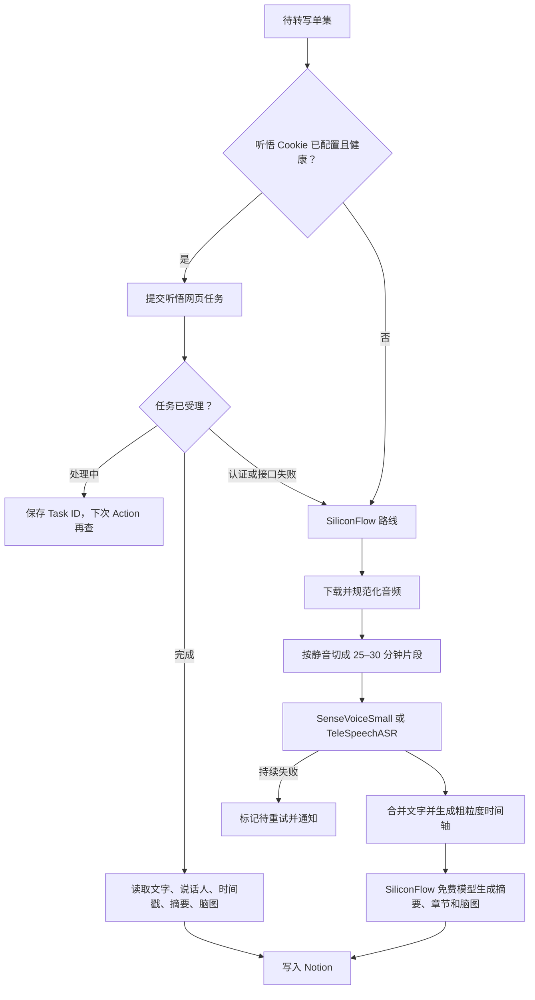

# 小宇宙到 Notion：语音识别方案全面调查与 Fallback 设计

## 一、最终结论

可以按下面的顺序实现，符合“代码开源、数据自主、无 VPS、无需作者服务”的原则：

1. **首选：通义听悟网页 Cookie**
   - 使用你截图中的 1708 小时网页转写余额。
   - 获取听悟原生的逐字稿、说话人、时间戳、章节、摘要和思维导图。
   - 优点是功能最完整、当前边际费用为零。
   - 缺点是依赖网页 Cookie 和未公开接口，可能因 Cookie 失效、风控或网页接口改版而中断。

2. **第一降级：SiliconFlow 官方 ASR API**
   - 默认模型：`FunAudioLLM/SenseVoiceSmall`。
   - 方言播客可选：`TeleAI/TeleSpeechASR`。
   - 两个模型在 SiliconFlow 当前价格页均标为“免费”，实名认证后免费模型的账单消耗为 0。
   - API 稳定性和可维护性远高于网页 Cookie。
   - 但当前接口只返回 `text`，没有说话人标签或句级时间戳；长音频还必须切片。

项目只实现上面两层，不接入正式付费 ASR。Cookie 和两个免费模型都不可用时，
保留任务状态并等待下一次 GitHub Actions 重试。

## 二、截图中的 1708 小时到底是什么

截图来自 `https://tingwu.aliyun.com/home`，显示：

- 剩余转写时长：1708 小时 25 分钟；
- 存储空间：52.6 MB / 200 GB；
- 支持“上传音视频”和“播客链接转写”。

这是**通义听悟网页产品的账户权益**，不是 DashScope API Key 的免费余额。

官方通义听悟开发套件需要单独创建 AccessKey、开通项目，并通过 OpenAPI 提交任务。当前公开价格为：

- 音视频文件转写：0.6 元/小时；
- 章节速览、全文摘要、问答回顾、思维导图等大模型功能：每项 0.064 元/小时，启用多项会叠加计费。

官方文档没有提供把网页剩余时长绑定到 OpenAPI 的方法。因此，若要消耗截图中的 1708 小时，只能通过网页或模拟网页请求；使用正式 API 会走另一套鉴权和账单。

参考：

- [通义听悟计费规则](https://help.aliyun.com/zh/tingwu/pricing-and-billing-rules)
- [通义听悟离线转写 API](https://help.aliyun.com/zh/tingwu/offline-transcribe-of-audio-and-video-files/)
- [通义听悟功能规格](https://help.aliyun.com/zh/tingwu/features)

## 三、作者方案实际用了什么模型

### 1. 无法确认网页端的精确模型 ID

作者代码没有调用 `fun-asr`、`paraformer-v2` 或其他公开模型 ID。它只把语言设为中文、设置说话人数，然后调用通义网页内部接口。网页后端究竟使用哪个 ASR 模型，阿里云没有在网页产品文档或返回数据中公开，所以不能把作者方案简单等同于某个 DashScope 模型。

### 2. 作者的 Cookie 链路已经被源码证实

PyPI `podcast2notion==0.2.5` 中的实际流程是：

1. 用小宇宙音频 URL 调用 `parseNetSourceUrl`；
2. 轮询 `queryNetSourceParse`；
3. 调用 `record/blog/start` 发起网页转写；
4. 用 `getTransResult` 获取按说话人组织的文字稿；
5. 用 `getAllLabInfo` 获取全文摘要、章节、问答和思维导图；
6. 用 `getTransDocEdit` 获取听悟笔记。

涉及的域名为：

- `qianwen.biz.aliyun.com`
- `tw-efficiency.biz.aliyun.com`

请求身份是完整的浏览器 Cookie，而不是官方 API Key。这解释了为什么作者能使用网页账户的免费时长，也解释了它为什么容易失效。

源码证据：

- [提交网页转写任务](https://github.com/malinkang/Podcast2NotionPro/blob/8d1e6d4ceb7a768c1fc17a5206bab86cb3b78d6f/podcast2notion/podcast.py)
- [读取转写、摘要和脑图](https://github.com/malinkang/Podcast2NotionPro/blob/8d1e6d4ceb7a768c1fc17a5206bab86cb3b78d6f/podcast2notion/speech_text.py)

## 四、Cookie 路线的真实优缺点

| 项目 | 结论 |
| --- | --- |
| 是否能使用 1708 小时 | 大概率可以；作者代码走的正是网页任务链路，最终仍需用你的账户实测一次确认 |
| 是否是官方开放 API | 不是 |
| 能否自动续期 | 没有公开、稳定的刷新接口；Cookie 失效后通常需要重新登录并更新 GitHub Secret |
| 识别结果 | 最完整：文字、时间戳、说话人、摘要、章节、问答、脑图 |
| 主要失败原因 | 401/403、跳转登录、Cookie 过期、风控、内部 URL 或 JSON 字段改变 |
| 安全性 | Cookie 等价于网页会话凭证，敏感程度高于普通单用途 API Key |
| 适合定位 | 可替换的首选 Provider，不应成为整个项目无法绕开的核心 |

安全实现要求：

- Cookie 只保存在用户自己的 GitHub Actions Secret。
- 代码只允许把 Cookie 发往明确白名单中的阿里云域名。
- 禁止打印请求头、Cookie、完整异常请求对象。
- 不使用第三方 Action 处理 Cookie，核心流程只运行仓库内可审计代码。
- 不使用 `pull_request_target` 运行带 Secret 的不可信 PR。
- Cookie 健康检查只返回 `healthy / expired / schema_changed`，不回显任何值。
- 最好使用私有仓库运行；若公开运行，只有仓库所有者保留写权限。

GitHub 官方提醒：Secret 会加密保存并尽量在日志中脱敏，但对结构化、转换后的值并不保证完全遮盖，因此不能依赖日志脱敏来弥补代码泄漏。

参考：[GitHub Actions Secrets 安全说明](https://docs.github.com/en/actions/reference/security/secure-use)

## 五、SiliconFlow 免费 ASR 调查

### 1. 当前确实有两个免费模型

截至 2026-07-29，SiliconFlow 官方价格页列出：

| 模型 | 当前价格 | 更适合 |
| --- | --- | --- |
| `FunAudioLLM/SenseVoiceSmall` | 免费 | 普通话、中英混合、粤语及多语言播客；建议作为默认 |
| `TeleAI/TeleSpeechASR` | 免费 | 方言较多的中文内容；建议作为可选模型 |

SiliconFlow 官方规则说明：实名认证后可以调用免费模型，账单消耗显示为 0；免费模型使用固定 Rate Limits。

参考：

- [SiliconFlow 价格页](https://siliconflow.cn/pricing)
- [SiliconFlow 免费模型与限流规则](https://docs.siliconflow.cn/cn/userguide/rate-limits/rate-limit-and-upgradation)

### 2. API 限制非常关键

官方端点为：

`POST https://api.siliconflow.cn/v1/audio/transcriptions`

限制与返回值：

- 必须上传本地音频文件，不能直接传小宇宙 URL；
- 单文件最长 1 小时；
- 单文件最大 50 MB；
- 支持的模型只有上述两个；
- 当前响应结构只有 `{"text": "..."}`。

这意味着一个 2 小时播客必须先在 GitHub Runner 下载，再经 FFmpeg 压缩和切片，然后逐片上传。SiliconFlow API 本身不能还原听悟那种精确的说话人和句级时间戳。

参考：[SiliconFlow 语音转文字 API](https://docs.siliconflow.cn/cn/api-reference/audio/create-audio-transcriptions)

### 3. 两个模型如何选择

推荐默认使用 `SenseVoiceSmall`：

- 官方模型项目称其支持 50 多种语言；
- 具备中文、粤语、英文等多语言 ASR 能力；
- 非自回归，推理速度快；
- 模型本身还支持情感和音频事件识别。

但 SiliconFlow 当前的简化 API 只返回文字，不代表这些附加能力全部暴露。

`TeleSpeechASR` 的公开模型说明强调多方言识别，适合四川话、上海话、粤语等方言明显的单集。它不应无条件替换 SenseVoice，而应提供一个配置项：

```yaml
asr:
  siliconflow_model: FunAudioLLM/SenseVoiceSmall
```

参考：

- [SenseVoice 官方项目](https://github.com/FunAudioLLM/SenseVoice)
- [TeleSpeech-ASR 模型说明](https://huggingface.co/Tele-AI/TeleSpeech-ASR1.0)

### 4. “免费”不能视为永久契约

SiliconFlow 文档明确表示模型可能上下线或调整能力，历史公告中也出现过语音模型下线。虽然当前 API 文档和价格页再次列出了 SenseVoiceSmall，但项目必须把模型 ID 做成配置，并在每次同步前做轻量可用性检查。

因此正确表述是：

> SiliconFlow 目前是正式 API、当前调用价格为 0；它比 Cookie 稳定，但平台没有承诺这个模型和价格永久不变。

## 六、推荐的自动降级架构



### Provider 接口

三个实现必须返回统一数据结构：

```text
TranscriptResult
├── provider
├── model
├── full_text
├── segments[]
│   ├── start_ms
│   ├── end_ms
│   ├── speaker
│   └── text
├── summary
├── chapters[]
├── mindmap
└── quality_flags[]
```

听悟 Cookie Provider 可以填满所有字段。SiliconFlow Provider 只能获得每个切片的文本，因此：

- `start_ms/end_ms` 使用切片边界，只能算粗粒度时间轴；
- `speaker` 设为 `null`；
- 摘要、章节、脑图由后续千问生成；
- Notion 页面必须标明“文字稿来源”和“是否为粗粒度时间轴”，避免把降级结果伪装成精确结果。

## 七、音频切片策略

虽然 SiliconFlow 上限是 1 小时 / 50 MB，实际不要切到极限。建议：

- 下载小宇宙音频到 Runner 临时目录；
- 转为单声道、16 kHz；
- 目标码率 32–48 kbps；
- 优先按静音切为 25–30 分钟；
- 每段前后保留 2–3 秒重叠；
- 合并时对重叠文本去重；
- 每段顺序调用，429 时指数退避；
- 不把音频上传为 GitHub Artifact，工作流结束即随 Runner 销毁。

这样通常每段远低于 50 MB，也给接口的时长检测、封装误差和网络重试留下余量。

## 八、哪些错误应该触发 Fallback

| 情况 | 处理 |
| --- | --- |
| Cookie 401/403、跳转登录页 | 立即标记 Cookie 过期，降级到 SiliconFlow |
| 听悟接口 404、返回字段缺失 | 标记 `schema_changed`，降级到 SiliconFlow |
| 听悟 429、5xx、网络超时 | 指数退避重试 3 次，仍失败再降级 |
| 听悟任务已经受理但仍在处理 | 不降级；保存任务 ID，下一次工作流继续查询，避免重复转写 |
| 听悟任务明确失败 | 降级 |
| SiliconFlow 429 | 延迟并在下一次工作流继续，不要立即重复轰炸 |
| SiliconFlow 某个模型 404/下线 | 自动尝试另一个免费 ASR 模型 |
| 两个 SiliconFlow 模型均失败 | 保留可重试状态，等待下一次工作流，不调用付费模型 |

## 九、Notion 中需要补充的状态字段

在原计划的 Episodes 数据库中增加：

- `ASR Provider`：tingwu_web / siliconflow
- `ASR Model`
- `ASR Quality`：full / coarse_timestamps / text_only
- `ASR Task ID`
- `ASR 状态`
- `Cookie 健康状态`
- `失败类型`
- `下次重试时间`
- `转写版本`
- `AI 摘要版本`

这些状态会让 GitHub Actions 可以中断后继续，不会因为一次工作流失败就重复提交、重复写 Notion。

## 十、实施顺序调整

最终方案调整为只使用听悟网页额度和 SiliconFlow 免费模型：

### Phase 1：SiliconFlow 官方免费 API

先实现最稳定、最容易自动测试的链路：

- 音频下载、FFmpeg 规范化和切片；
- SenseVoiceSmall / TeleSpeechASR；
- 文本合并；
- SiliconFlow 免费摘要、章节和脑图；
- Notion 写入。

### Phase 2：听悟 Cookie Provider

在统一 Provider 接口上增加：

- Cookie 健康检查；
- 网页任务提交；
- 异步状态查询；
- 文字、说话人、摘要、章节、问答和脑图解析；
- 失败熔断与自动降级。

虽然最终运行顺序是 Cookie 优先，但开发顺序应先完成 SiliconFlow。这样调试 Cookie 时始终有一条可用的官方 API 链路，不会把所有进度卡在一个未公开接口上。

## 十一、验收标准

至少选择 6 个 20–120 分钟的播客单集：

- 普通话访谈 2 个；
- 中英混合 1 个；
- 方言明显 1 个；
- 多人对话 1 个；
- 背景音乐或远场录音 1 个。

逐个验证：

1. Cookie 有效时，能提交并取回听悟完整结果；
2. 人工把 Cookie 改错后，能自动降级到 SiliconFlow；
3. 超过 1 小时或 50 MB 的音频能自动切片；
4. SiliconFlow 结果能合并且不会明显重复段首段尾；
5. 429、5xx 和 GitHub Action 中断后可以继续；
6. Notion 明确显示实际 Provider 和结果精度；
7. 用户笔记不会被自动内容覆盖；
8. 所有日志中都不存在 Cookie、API Key 和 Notion Token；
9. 任何失败都不会自动调用付费 ASR 或付费摘要模型；
10. 免费模型不可用时，任务进入可恢复失败状态，而不是静默丢失。

## 十二、最终建议

你的想法可行，我建议把产品默认配置定为：

```yaml
asr:
  provider_order:
    - tingwu_cookie
    - siliconflow
  siliconflow_models:
    - FunAudioLLM/SenseVoiceSmall
    - TeleAI/TeleSpeechASR
summary:
  enabled: true
  siliconflow_models:
    - Qwen/Qwen3-8B
    - Qwen/Qwen2.5-7B-Instruct
```

这套默认行为就是：

> 先尽量消耗你现有的通义听悟网页免费时长；Cookie 或网页接口不可用时，自动改用 SiliconFlow 的免费 ASR API；免费模型仍不可用时保存状态并等待重试，绝不自动调用付费模型。
